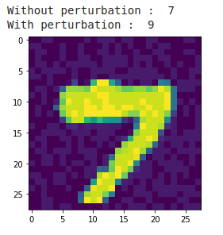

I was a part of the project CNN-lytical under the mentorship of Akshat Kumar, Vaibhav Raj, Ashwin Ramachandran. 

In this repo, I am including the following Pre-Project resources: 
1. Programming Assignments
2. Project Selection Assignments

The programming assignments were in the form of notebooks, so can be run using google colab. In addition, the project included watching lectures of CS231n, a course offered by Stanford University

Link for CS231n Lectures - https://www.youtube.com/watch?v=i94OvYb6noo&list=PLkt2uSq6rBVctENoVBg1TpCC7OQi31AlC&index=5

In addition, I have included the project selection assignments that was used a checkpoint. These assignments have been written in LaTeX, and contain the summaries of lectures 2,3 in the CS231n playlist. Moreover, I have included the summary of lecture 4 in case anyone is interested. 

Summarising the programming assignments, this repo contains : 
1. Assignment 1 - Building a single layer neural network that classifies the MNIST dataset from scratch
2. Assignment 2 - Building a neural network using PyTorch for classifying the MNIST dataset
3. Assignment 3 - A CNN for classifying the CIFAR-10 dataset. 

In addition, the repo contains Project implementations + research papers : 

As the SoC Project, I studied and implemented the topic " Adversarial Attacks on Computer Vision Models " under the mentorship of Vaibhav Raj. 
This topic deals with adversarial generation of images which look normal to the human eye, yet are misclassified by the image classifier. 

As a part of the project I studied the following papers : 
1. Advances in adversarial attacks and defenses in computer vision: A survey
by Naveed Akhtar, Ajmal Mian, Navid Kardan and Mubarak Shah
2. EXPLAINING AND HARNESSING ADVERSARIAL EXAMPLES
by Ian J. Goodfellow, Jonathon Shlens & Christian Szegedy
3. DeepFool: a simple and accurate method to fool deep neural networks
by Seyed-Mohsen Moosavi-Dezfooli, Alhussein Fawzi, Pascal Frossard Ecole Polytechnique F ́ed ́erale de Lausanne

In addition to the papers, I have implemented the following models : 
1. FGSM (Fast Gradient Sign Method) Attack on Neural Networks : In this implementation (FGSM.ipynb), I have used the first programming assignment and in the same spirit of doing everything from scratch, have implemented the FGSM algorithm using only the numpy library. The implementation contains cells which show : 
  i. Generation of adverserial examples 
  ii. Normal example generation and predictions 
  iii. Accuracy upon some fixed maximum perturbation using the FGSM attack

You can observe that running the cell with values of epsilon we get the following values of % accuracy of the neural network : 
epsilon = 0.01 ; 83.5% . 
epsilon = 0.05; 62.4% . 
epsilon = 0.1; 24.6% . 
This trend indeed supports the hypothesis of the papers. 

2. DeepFool Algorithm : In this implementation (DeepFool.ipynb), I have again used the first programming assignment and have used only the numpy library. The implementation contains cells showing : 
  i. Generation of adverserial examples
  ii. Normal example generation and predictions 
  iii. Accuracy upon some fixed maximum perturbation using the FGSM attack 
DeepFool is so powerful that in most cases I got an accuracy of nearly 0.0% by the image classifier. For more information on DeepFool you can have a look at paper3.pdf of this repo. 

The experience of the SoC has been very useful, and hopefully this repository helps :)

This repo is maintained by Soham Joshi, email - sohamjoshitab2@gmail.com
